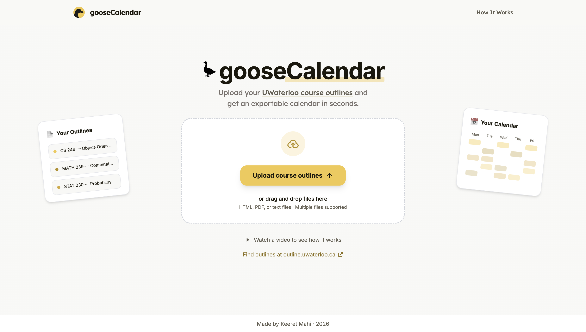

# GooseCalendar



GooseCalendar turns course outlines into calendar events. Upload an outline, review the lectures, tutorials, labs, assignments, assessments, and office hours it finds, then export the events to Google Calendar or an `.ics` file.

The app is designed around University of Waterloo outlines, while also supporting PDF, HTML, and text-based outlines from other sources.

## How It Works

1. **Upload** one or more course outline files.
2. **Parse** reliable UWaterloo schedule data such as sections, meeting days, times, date ranges, and locations.
3. **Extract** the remaining calendar events with OpenAI. For unstructured or non-UWaterloo files, GooseCalendar processes the full outline with AI.
4. **Review** the detected sections and events, correcting anything marked as incomplete.
5. **Export** the selected events to Google Calendar or download them as an `.ics` file.

For recurring classes, the start and end dates are treated as range boundaries. Actual occurrences are generated only on the listed weekdays. For example, a January 1 to May 2 range that meets Tuesdays and Thursdays starts on the first Tuesday or Thursday in that range, not automatically on January 1.

UWaterloo students can download their outlines from [outline.uwaterloo.ca](https://outline.uwaterloo.ca/).

## Local Development

Requirements:

- Node.js 18 or newer
- npm
- An OpenAI API key for AI extraction

Install dependencies and create your local environment file:

```bash
npm install
cp .env.example .env.local
```

Add at least your OpenAI API key to `.env.local`, then start the development server:

```bash
npm run dev
```

Open [http://localhost:5173](http://localhost:5173). Vite will print a different URL if that port is already in use.

Create a production build with:

```bash
npm run build
```

## Environment Variables

| Variable | Purpose |
| --- | --- |
| `OPENAI_API_KEY` | Enables AI-assisted outline extraction. |
| `OPENAI_MODEL` | Overrides the OpenAI model used by the server extraction endpoint. |
| `OPENAI_TIMEOUT_MS` | Controls the OpenAI request timeout. |
| `OPENAI_MAX_OUTPUT_TOKENS` | Sets the output-token budget for extracted event JSON. Full-outline extraction enforces its own minimum. |
| `VITE_GOOGLE_CLIENT_ID` | Enables direct Google Calendar export. |
| `AI_EXTRACTION_CACHE_ENABLED` | Set to `false` to disable the Firebase extraction cache. |
| `AI_EXTRACTION_RATE_LIMIT_ENABLED` | Set to `false` to disable server-side AI request limits. Enabled by default. |
| `AI_EXTRACTION_PER_CLIENT_DAILY_LIMIT` | Maximum uncached outlines per anonymous browser/device per UTC day. Defaults to `10`. |
| `AI_EXTRACTION_GLOBAL_DAILY_LIMIT` | Maximum uncached outlines across the app per UTC day. Defaults to `300`. |
| `FIREBASE_PROJECT_ID` | Firebase Admin project used by the server-side cache. |
| `FIREBASE_CLIENT_EMAIL` | Firebase Admin service-account email. |
| `FIREBASE_PRIVATE_KEY` | Firebase Admin service-account private key. |
| `FIREBASE_SERVICE_ACCOUNT_JSON` | Optional JSON alternative to the individual Firebase Admin variables. |
| `VITE_FIREBASE_*` | Optional Firebase web configuration used for client-side analytics. |

Keep `OPENAI_API_KEY` and all Firebase Admin credentials server-side. Never prefix them with `VITE_`.

### Google Calendar Setup

Create a Google OAuth web client and add both the local and production domains as Authorized JavaScript origins. Set its client ID as `VITE_GOOGLE_CLIENT_ID`.

GooseCalendar requests the narrow `calendar.app.created` scope. It creates calendars owned by the app and uses Google's standard event colours, so it does not need broad access to the user's existing calendars.

### Firebase Cache Setup

The cache is optional. When Firebase Admin credentials are configured, successful AI results are stored using a versioned key containing the extraction mode and a SHA-256 hash of the outline. Uploading the same outline again can reuse the structured result instead of making another OpenAI request.

If Firebase is unavailable or a cache operation fails, extraction falls back to OpenAI.

Only cache misses count against the AI extraction limits. The server recomputes each outline's
content hash rather than trusting the browser, and identical in-flight requests share one OpenAI
call within a warm server instance.

## Deployment

The frontend is built with Vite and can be deployed to Vercel. The server-side extraction handler is exposed through `api/extract-outline-events.ts` and runs as a serverless function in production. Add the same required environment variables to the Vercel project before deploying.

## Tech Stack

- React 18 and TypeScript
- Vite 6 and Tailwind CSS 4
- React Router
- OpenAI API with structured JSON output
- Firebase Admin and Firestore caching
- Google Identity Services and Google Calendar API
- `date-fns` and custom iCalendar generation

## Project Structure

```text
api/                              Vercel serverless entry point
src/app/components/               Application screens and UI
src/app/lib/parser.ts             Deterministic and hybrid outline parser
src/app/lib/outlineSource.ts      HTML, text, and pure TypeScript PDF extraction
src/app/lib/calendar.ts           ICS generation
src/app/lib/googleCalendar.ts     Google Calendar export
src/server/openaiOutlineExtractor.ts
                                  OpenAI extraction endpoint
src/server/firebaseExtractionCache.ts
                                  Firebase extraction cache
```
